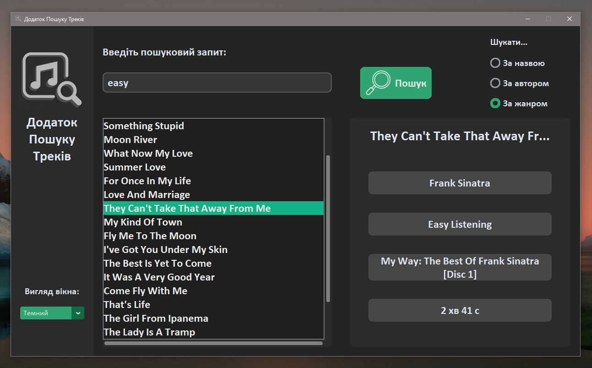
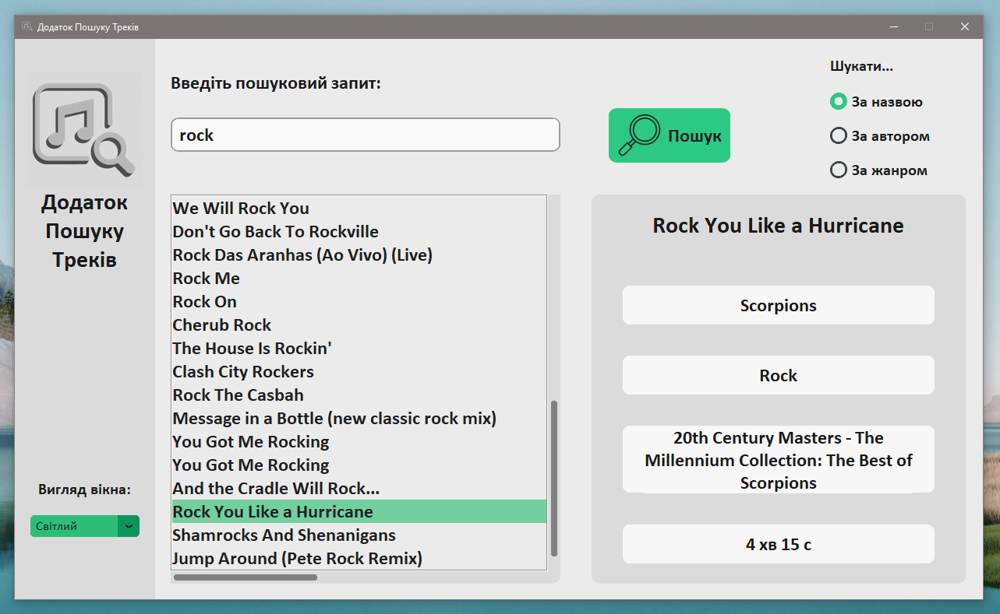

# Track Finder App

 An app/GUI that is linked to a database called "chinook". User will be able to do a bunch of operations with a database (like searching information) through this program. 
 
 It uses [**CustomTkinter UI-Library by Tom Schimansky**](https://github.com/TomSchimansky/CustomTkinter) to have a modern look. So install this module with pip to run the app file (App_GUI.py):
```
pip install customtkinter
```
 Plus, Pillow library is also used to work with images, make sure you download it too:
```
pip install pillow
```

---


| _`App_GUI.py` on Windows 10 with dark mode and standart 'green' theme_


| _`App_GUI.py` on Windows 10 with light mode and standard 'green' theme_
